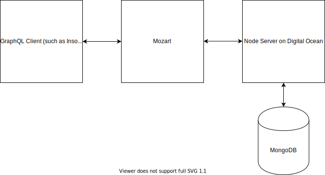

# Mozart, a GraphQL Server for Hoon

This project is a GraphQL Server established according to the official spec (see [here](https://github.com/graphql/graphql-spec) and [here](https://spec.graphql.org/June2018/)). It is client-agnostic. So far, I've have been testing it with [Insomnia](https://insomnia.rest/), which offers a handy option to send a GraphQL-formatted request, but technically any HTTP POST request conforming to the spec should work.

As currently implemented, Mozart parses incoming GraphQL requests and sends an outbound request to a Node server which returns a result from a MongoDB database. Current functionality is limited to queries. An illustration of the workflow is below:

<br></br>
<br></br>
<p align="center">
  
</p>
<br></br>

Before running, please create a file name `env-vars.hoon` in `/home/lib` to save your environmental variables in a map in the following format:

```
(my ~[[%one 1] [%two 2] [%three 3]])
```

Three are listed above to give an example of how a list of environmental variables looks, but for the current implementation of Mozart, you only need a single variable `%db-ip`, which is a cord. I provide this variable in the email submitting the hackathon project and can provide it to anyone else as needed. Just send me an email at chris@cking.me. Ultimately, `env-vars.hoon` will look like this:

```
(my ~[[%db-ip 'an IP address']])
```

To test Mozart, use Insomnia or a similar tool to send a GraphQL request of the following form:

```
{
  getBooks {
    author
  }
}
```

or

```
{
  getBooks {
    title
  }
}
```

You should receive the proper data in response. For now, this response is a simple string indicating the data payload returned. Eventually, I intend to have detailed responses including relevant metadata about the request.

Future features include the following principal elements of a complete GraphQL Server:

*  Handle nested query layers with more than one item, like the following:

  ```
  {
    getBooks {
      author
      title
    }
  }
  ```
*  Handle nested query layers at depths of more than one, like the following:

  ```
  {
    composers {
      baroque {
        bach {
          nationality
        }
      }
      classical {
        mozart {
          nationality
        }
      }
      romantic {
        chopin {
          nationality
        }
      }
    }
  }
  ```

*  Mutations with and without inputs (partially implemented already)
*  Rigorous validation (basic validation is already included)
*  Extensive error handling for malformed queries and mutations
*  Introspection
*  User auth
*  A test suite
*  A MongoDB driver for direct routing to the database without the mediation of a Node server

I also intend a major refactoring of the string parsing logic. Currently, strings are `tapes` manipulated with `map` logic, as I did not yet grasp Hoon's actual string parsing methods very well. This `map` logic will be replaced with more generalized `arms` containing proper parsing methods. 

Contributors: this repo follows the [Conventional Commit](https://www.conventionalcommits.org/) spec. You may wish to download the [VSCode Conventional Commit extension](https://marketplace.visualstudio.com/items?itemName=vivaxy.vscode-conventional-commits) if you use VSCode as your text editor.
